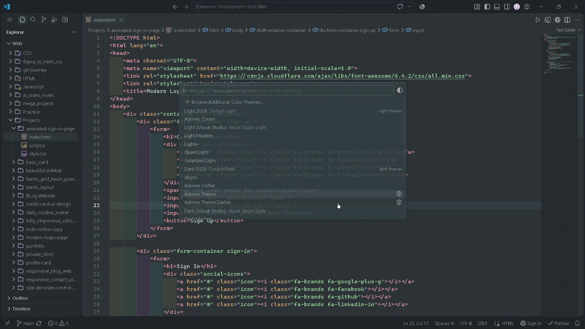
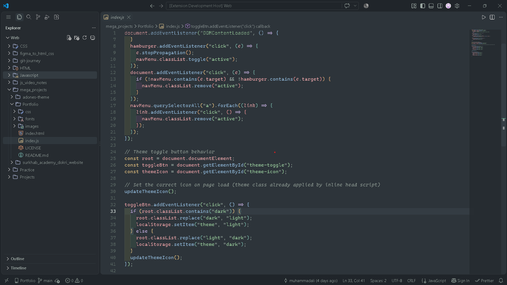
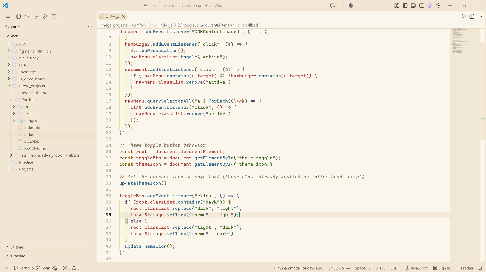
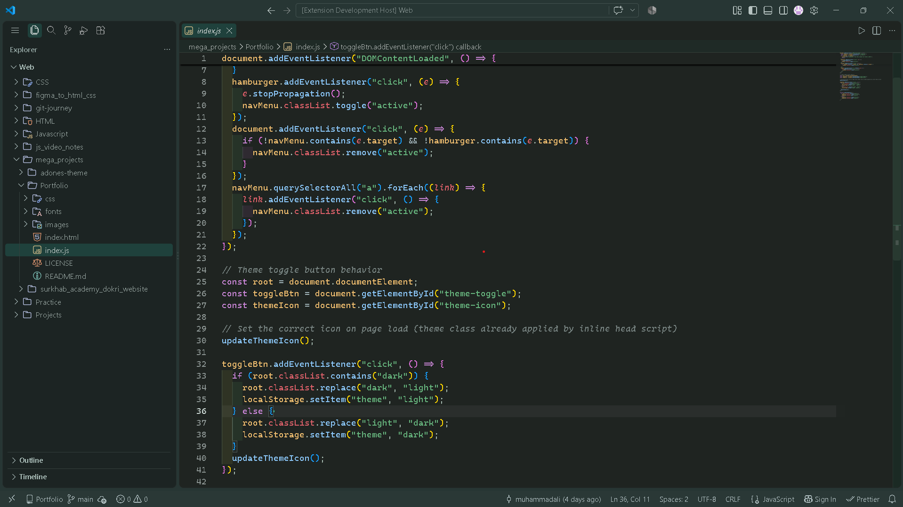
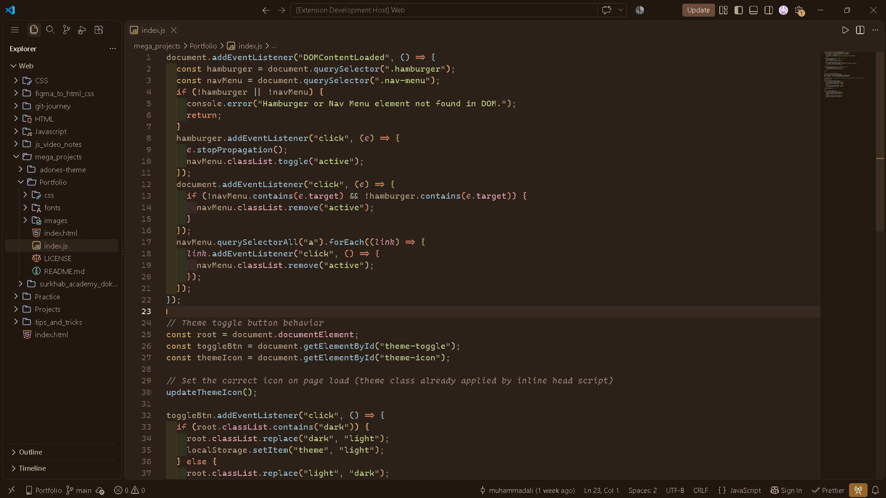

# Adones Theme

A calm, carefully balanced VS Code theme family designed for long coding sessions without relying on overly bright backgrounds or aggressive syntax colors.

Adones comes in four variants:

- 🌿 **Adones Theme** — a darker lower contrast variant, good for eyes and Late Night Work.
- ☕ **Adones Cream** — a **creamy**, lighter variant designed for daytime use.
- 🌑 **Adones Theme Darker** — A higher Contrast, better looking variant designed for Daytime/Nighttime.
- 🫘 **Adones Coffee** — A warm, espresso-toned dark variant with coffee-shop inspired syntax colors and a bit more contrast than the original Adones Theme.

> **Design philosophy:** Keep the interface comfortable, readable, and visually interesting without turning the editor into a wall of saturated colors.

---

## Quick Preview
#### I have bold text so yours might look a bit different.

---

## Preview

### Adones Theme

### Adones Cream

### Adones Theme Darker

### Adones Coffee

---

## ✨ Features

- 🌿 Four carefully balanced color variants
- 👀 Designed with long coding sessions in mind
- 🎨 Soft, restrained syntax highlighting
- 🖥️ Comfortable editor and UI backgrounds
- 🌙 Dark green variant for evening/night use
- ☕ Warm espresso variant for a cozier, higher-contrast feel
- 💻 Designed specifically for Visual Studio Code
- 🧩 **Tested In:** HTML, CSS, JavaScript, and should work in most other languages too.
- ⚡ Lightweight — no additional runtime dependencies

---

## 🎨 The Variants

### 🌿 Adones Theme

**Best suited for:** Evening and nighttime coding.

Adones Theme uses a deeper, muted background with green as an important part of its visual identity.

The goal is to provide enough contrast for code to remain easy to read while avoiding the extremely high-contrast appearance found in many traditional dark themes.

**Primary characteristics:**

- Dark, muted background
- Green-inspired interface elements
- Soft syntax colors
- Controlled contrast

---

### ☕ Adones Cream

**Best suited for:** Daytime coding.

Adones Cream provides a lighter alternative while keeping the same overall design language as Adones Theme.

Instead of using a pure white background, it uses a warmer cream-toned palette to make the interface feel softer and less stark.

**Primary characteristics:**

- Warm cream background
- Muted interface colors
- Clear but restrained syntax highlighting
- Comfortable text contrast

---

### 🌑 Adones Theme Darker

**Best suited for:** Daytime or Nightime coding.

Adones Theme Darker uses a deeper, darker background with green as an important part of its visual identity.

The goal is to provide just enough contrast for code to remain easy to read while avoiding the extremely high-contrast appearance found in many traditional dark themes.

**Primary characteristics:**

- Dark background
- Green-inspired interface elements
- Higher Contrast syntax colors
- Controlled contrast

---

### 🫘 Adones Coffee

**Best suited for:** Anyone who wants a warmer, cozier dark theme with a bit more punch than the original Adones Theme.

Adones Coffee swaps the family's usual cool, green-leaning palette for a warm espresso-brown background with a coffee-shop inspired syntax palette — mocha, caramel, terracotta, olive, and dusty rose. It sits between "good for the eyes" and "cyberpunk neon": more contrast and hierarchy than the low-contrast originals, without leaning on bright, saturated colors.

**Primary characteristics:**

- Warm espresso-brown background
- Coffee-inspired syntax palette (mocha, caramel, terracotta, olive, dusty rose)
- Clear hierarchy between syntax roles
- Moderate-to-higher contrast, still restrained

---

## 🧠 Design Philosophy

Adones was created around a simple idea:

> **A good coding theme should help you focus on your code, not compete with it.**

Many themes use a large number of highly saturated colors to make syntax immediately distinguishable.

Adones takes a more restrained approach.

The palette intentionally uses:

- A small number of primary colors
- Supporting colors where they provide useful distinction
- Softer syntax highlighting
- Muted backgrounds
- Clear hierarchy between UI elements
- Enough contrast for readability without making everything visually loud

The goal is to create something that still feels beautiful after several hours of use.

---

## 📦 Installation

### From the VS Code Marketplace

[Get it from here](https://marketplace.visualstudio.com/items?itemName=dev-mhd-ali.adones-theme)

1. Open **Extensions** in VS Code.
2. Search for **Adones Theme**.
3. Click **Install**.
4. Open the Command Palette with `Ctrl + Shift + P`.
5. Search for **Preferences: Color Theme**.
6. Select your preferred Adones variant.

---

### From a `.vsix` file

If you downloaded a `.vsix` release:

1. Open VS Code.
2. Open the Extensions panel.
3. Click the `...` menu.
4. Select **Install from VSIX...**
5. Select the downloaded `.vsix` file.
6. Select the Adones theme from the Color Theme picker.

---

## 🧪 Supported Languages

Adones has been tested with:

- HTML
- CSS
- JavaScript
- JSON

If you find a language where the syntax highlighting doesn't look right, feel free to open an issue.

---

## 💡 Suggestions

Suggestions for improving Adones are welcome.

If you have an idea for:

- Better syntax colors
- Improved contrast
- UI color adjustments
- New language support
- Accessibility improvements
- Additional theme variants

[**Suggestions for improving Adones are welcome.**](https://github.com/muhammadalidev26-prog/adones-theme/issues)

---

## 📜 License

**MIT License**

Copyright © 2026 Muhammad Ali

---

## 🙏 Credits

Created by [Muhammad Ali](https://github.com/muhammadalidev26-prog).

---

## 🌿 About Adones

Adones is more than just a collection of colors.

It is an attempt to create a coding environment that feels **calm, readable, and enjoyable to use every day**.

Whether you're working during the morning with **Adones Theme Darker**, coding in the afternoon with **Adones Cream**, unwinding into a cozier session with **Adones Coffee**, or coding late into the evening with **Adones Theme**, the goal remains the same:

**Write code. Stay focused. Let the theme stay out of the way.**